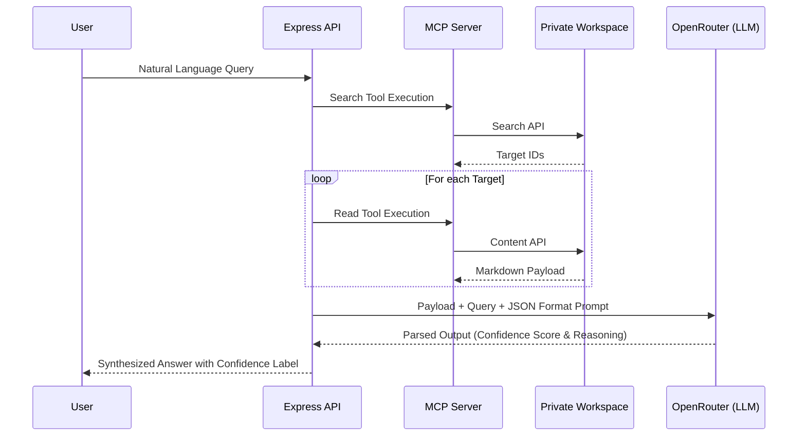

# Context Protocol Agent

A robust, full-stack AI agent built to interact securely with private workspace data. By leveraging the Model Context Protocol (MCP) and an intelligent LLM confidence-scoring layer, this architecture abstracts away standard API complexities and focuses on strict data verification.

## Architecture

This project is structured to demonstrate a modern, agentic ReAct loop over private data. It uses an Express.js backend and a minimal Vanilla JS frontend.

## How It Works

1. **Search**: The agent accepts natural language input and dynamically queries the workspace for relevant pages.
2. **Retrieve**: It pulls the full metadata and markdown content of the top matching results.
3. **Confidence Scoring**: The agent forces the LLM into a strict JSON output schema. It cross-references the retrieved documents to determine if the sources agree, conflict, or if there is insufficient data.
4. **Resolution**: The frontend surfaces the final answer alongside a strict Confidence Badge (`High confidence`, `Conflicting sources`, `Insufficient data`).

## Deployment

This application is designed to be deployed as a persistent Node.js web service (e.g., Render or Railway) to support the underlying MCP child processes. 

*Note: Access to the web interface is protected by a secure passphrase to prevent unauthorized API usage.*

---

**Disclaimer:** 
*This repository is built specifically for my personal workspace use cases and workflow automation. Forking is discouraged as it is heavily coupled to my specific environment configurations and security rules.*
