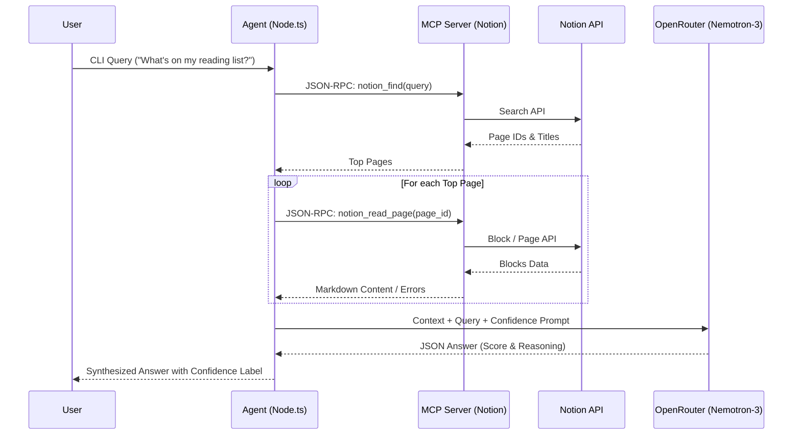

# Notion Trust Agent

A robust Node.js/TypeScript agent that connects to your Notion workspace, intelligently retrieves pages based on natural language queries, and uses NVIDIA's Nemotron 3 Super model via OpenRouter to synthesize answers with a built-in **confidence scoring** layer.

## Architecture

The project leverages the **Model Context Protocol (MCP)** to abstract away the Notion API complexities. The agent talks to a local MCP Notion server child process using `stdio`. The MCP server handles fetching and parsing Notion pages, which are then fed into the LLM.



## How It Works

1. **Search (`notion_find`)**: The agent takes your command line query and passes it to the Notion MCP Server to find relevant pages.
2. **Retrieve (`notion_read_page`)**: It pulls the markdown contents of the top 3 matching pages. 
3. **Confidence Scoring**: It sends the context to the LLM with a strict JSON format prompt. The LLM is instructed to determine if the sources agree with each other or if they conflict.
4. **Resolution**: The agent parses the LLM output and assigns one of the following flags to the answer:
   - `[High confidence]`
   - `[Medium confidence (Only 1 source found)]`
   - `[Conflicting sources]`
   - `[Insufficient data]`

## Quick Start

### 1. Setup Environment
Rename `.env.template` (or create a `.env`) and add your keys:
```env
NOTION_API_KEY=your_notion_integration_secret
OPENROUTER_API_KEY=your_openrouter_api_key
```

*Note: Ensure your Notion integration has "Read content" access and is connected to the pages you want to search!*

### 2. Install Dependencies
Make sure you have run:
```bash
npm install
cd mcp-notion-server
npm install
npm run build
cd ..
```

### 3. Run the Agent
```bash
npx tsx src/agent.ts "your question here"
```

## Example Output (Confidence Flagging in Action)

The script handles edge cases gracefully, such as permission issues or conflicting information. In this test run, the Notion integration didn't have access to the reading list page, resulting in a `404` tool error. The LLM successfully interpreted the error text, flagged the conflict, and explained the issue.

```console
$ npx tsx src/agent.ts "What is on my reading list?"

🔍 Searching Notion for: "What is on my reading list?"...
📚 Found 2 relevant page(s). Fetching content...

🧠 Sending context to OpenRouter...

=========================================
✨ ANSWER [Conflicting sources]
=========================================

I don't know what is on your reading list based on the provided documents.

---
🔍 Confidence Reasoning: The Reading List page could not be retrieved due to a 404 error, indicating the page is either not found or not accessible to the integration. The My dashboard page shows various blocks... but there is no mention of a reading list or its contents in the available context. Since the Reading List page is inaccessible... there is insufficient information to answer the question.
=========================================
```
